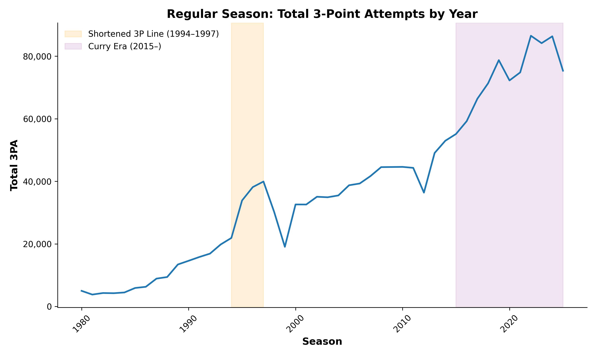
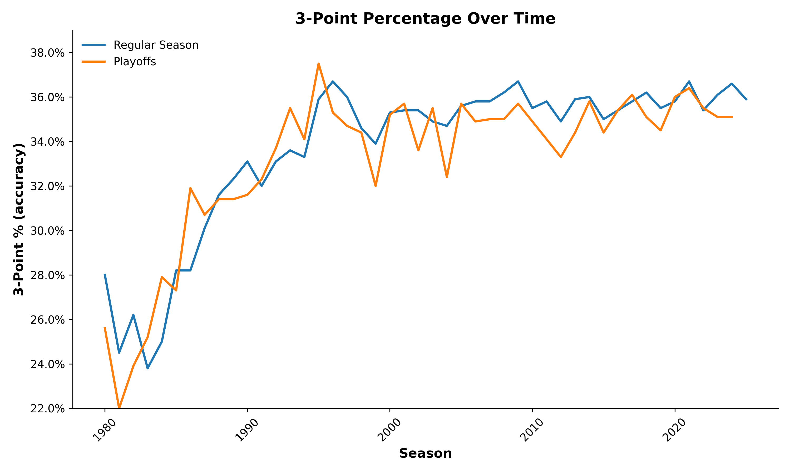
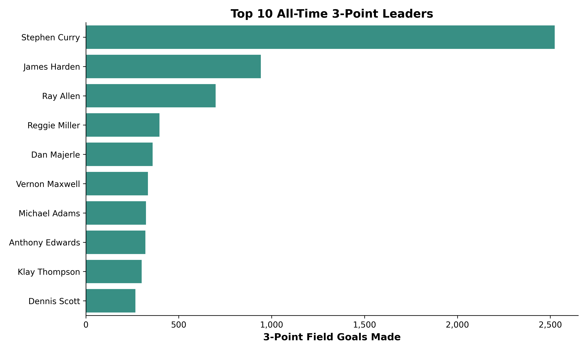
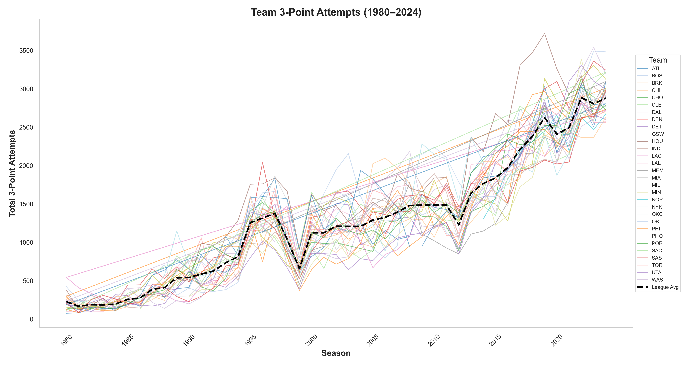
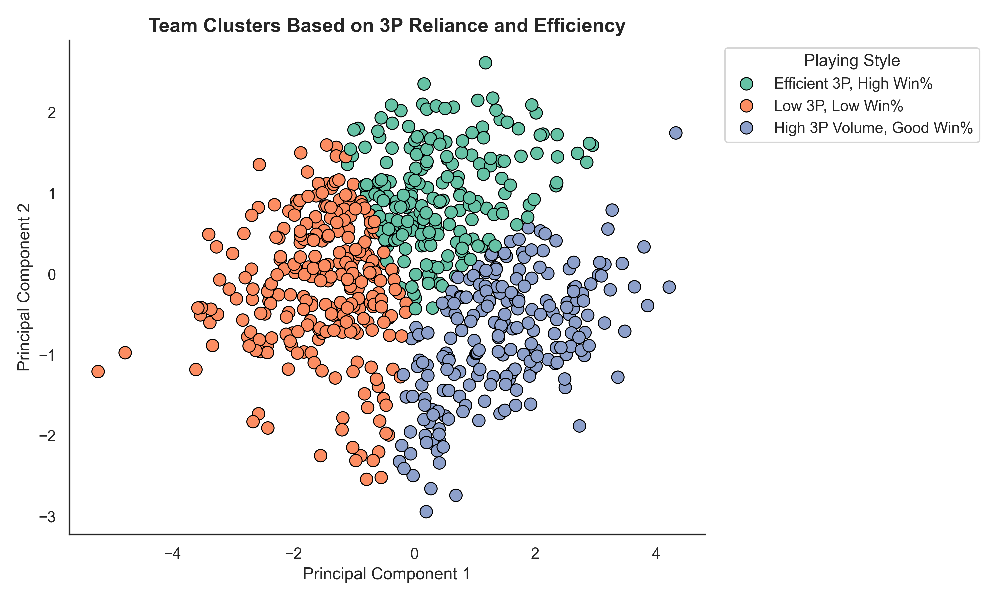

# The Three-Point Revolution: Is It Changing Basketball for Better or Worse?

## Overview
This project analyzes the NBA’s shift toward three-point shooting and its impact on competitiveness, game outcomes, and fan engagement. By examining historical game data and social media sentiment, this study aims to determine whether the three-point era has improved or harmed the game.

## Data Sources
- **NBA Statistics:** Three-point attempts, shot selection, win/loss records, player performance (Basketball Reference, NBA Stats API)
- **Social Media Sentiment:** Fan discussions on three-point shooting from Reddit

---

## Key Visualizations

### 📈 Total 3PA by Year

### 🎯 3-Point Accuracy Over Time

### 🏀 All-Time 3-Point Leaders

### 📊 Team 3PA Trends

### 🤖 Team Clustering Based on 3P Strategy

### 🧪 Cluster Win% Comparison

### 💬 Fan Sentiment Word Clouds

---

## Summary of Findings

- 📌 Teams that shoot efficiently from 3-point range win more — volume alone isn’t enough.
- 📌 Certain franchises evolve with the game, while others maintain a consistent style.
- 📌 Fan sentiment around the 3-point revolution is mostly positive and stable.

## Future Work

- Cluster players instead of teams
- Analyze playoff vs. regular season strategy
- Expand sentiment analysis to forums, interviews, and global fan reactions and media analysis
- Include attendance data
- Study blowouts and competitiveness
---

## Author
Charity Smith

## Author
Charity Smith

