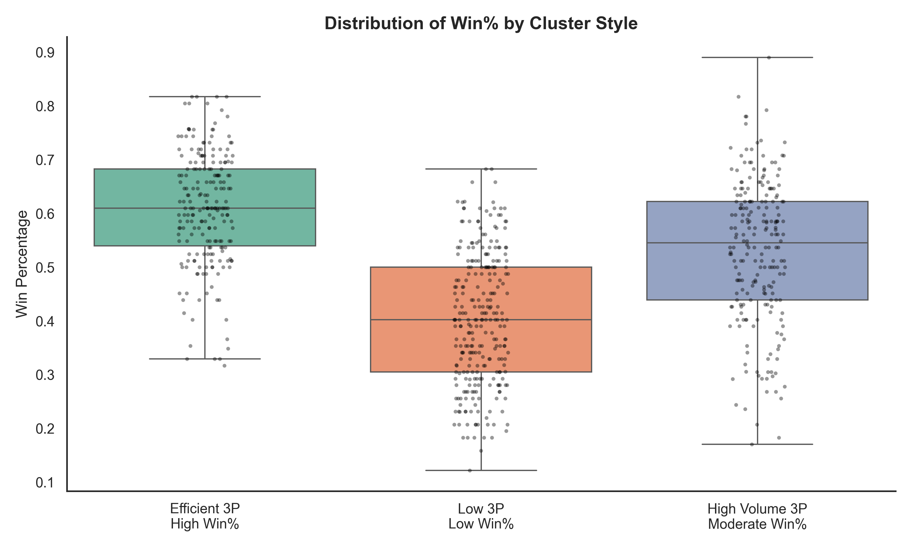

# The Three-Point Revolution: Is It Changing Basketball for Better or Worse?

## Overview
This project explores how the NBA’s increasing reliance on the three-point shot has affected competitiveness, win outcomes, playing styles, and fan sentiment. Through statistical analysis, machine learning, and sentiment mining, the project answers a critical question: Has the three-point revolution improved the NBA — or hurt it?

## Data Sources and Collection
I gathered data from two primary sources:

- **Basketball Reference & NBA.com/stats**: Provided team-level and player-level statistics from 1980 to 2024.
- **Reddit (r/nba)**: Supplied qualitative sentiment data from fan discussions around three-point shooting.

### Challenges and Data Preparation
Data scraping was conducted using Python’s `requests`, `BeautifulSoup`, and `pandas` libraries. The Basketball Reference data was not always straightforward — multiple challenges included:

- **Franchise name changes** (e.g., New Jersey Nets → Brooklyn Nets, Seattle SuperSonics → Oklahoma City Thunder) required mapping across multiple team abbreviations.
- **New team additions** (e.g., Toronto Raptors, Memphis Grizzlies) had to be integrated while preserving timeline consistency.
- **Shortened or irregular seasons** like the 1999 and 2012 lockouts or the COVID-affected 2020 season required annotation.

After cleaning, I compiled structured datasets with 3-point attempts, shooting efficiency, possessions (pace), win percentage, and more. Reddit post titles and content were also cleaned and vectorized for sentiment analysis.

## Methodology

### Exploratory Data Analysis
I first explored trends in three-pointers attempted and three-point shooting accuracy. Key trends emerged:

- **Three-pointers attempted per game** increased steadily post-2010.
- **Three-point shooting percentage** improved until 2015, then plateaued.
- Teams like the **Rockets** and **Warriors** were clear outliers in shot volume.

### Regression and Correlation
To quantify the relationship between three-point stats and winning:

- **OLS regression models** were fit for three eras: 2000–2010, 2011–2016, and 2017–2024.
- **Three-point shooting percentage** was a strong predictor of win percentage in the modern era (coef = 6.89, p = 0.006).
- Three-pointers attempted had a weak or negative relationship with winning in early years.

These results suggest efficiency — not volume — drives success.

### Clustering Analysis
I used **K-Means clustering** on team-level features like:

- Three-pointers attempted
- Three-point shooting percentage
- Effective field goal %
- Win %

To visualize high-dimensional data, I used **PCA (Principal Component Analysis)** to reduce it to 2D. This revealed three distinct team archetypes:

1. **Efficient 3-point shooters with high win percentages**
2. **High-volume 3-point shooters with moderate win rates**
3. **Low-volume 3-point shooters with low success**

Exemplar teams (those closest to the cluster centroids) included:
- 2007 Knicks (Cluster 3)
- 2002 Pistons (Cluster 2)
- 2022 Cavaliers (Cluster 1)

### Statistical Validation
To confirm that these clusters were meaningfully different, I ran **ANOVA** and **Tukey HSD tests**:
- F-statistic = 183.4, p < 0.0001 → differences in win% across clusters are statistically significant.
- All pairwise comparisons (Efficient vs High Volume, etc.) were significant at p < 0.001.

### Machine Learning Classification
I trained a **Random Forest classifier** to predict team cluster membership. The top features were:

- Three-point rate
- Effective field goal %
- Three-point shooting percentage

The model achieved high accuracy and showed clear feature importance for style prediction.

### Sentiment Analysis
Using Reddit data:

- I analyzed over 1,000 posts about 3-point shooting using Vader sentiment scoring.
- Despite surges in shot volume, sentiment remained stable over time.
- After 2015, sentiment even skewed slightly more positive.
- Common words included “great,” “fun,” and “defense,” while negatives were often injury-related.

## Visual Trends & Commentary

### 
Three-pointers attempted per game exploded post-2010, doubling across the league. This was heavily driven by analytic-era strategies.

### 
Accuracy improved dramatically from the '80s through the 2010s and has now stabilized. Today’s shooters are both more frequent and more consistent.

### 
Stephen Curry leads the pack, showing how modern players have shifted norms. Almost all top-10 three-point shooters are from the modern era.

### 
Every team now shoots more three-pointers. Some franchises like the Rockets were pioneers; others caught on later.

### 
This PCA visualization shows the three strategic groups. Color and shape help highlight style patterns across decades.

### 
Efficient shooters win the most. High-volume shooting without accuracy doesn’t pay off — statistically confirmed.

### 
Fans talk about defense, great performances, and spacing. Positivity held strong even as three-pointers exploded.

## Conclusion
The data tells a compelling story:

- **Efficiency > Volume** — shooting well, not just often, wins games.
- **Franchises adapt** — some teams evolve with the era; others remain stuck.
- **Fans are engaged** — the three-point era didn’t alienate audiences, even if strategy debates continue.

## Future Work

- **Cluster players** by role or efficiency, not just teams.
- **Playoff-specific strategy** — do winning teams shoot differently under pressure?
- **Analyze blowouts** — are lopsided scores more common in the three-point era?
- **Video-based shot quality** — use tracking data to gauge difficulty.
- **Fan sentiment beyond Reddit** — include interviews, forums, and attendance metrics.

## References

- Basketball Reference. (n.d.). *Basketball statistics and history*. https://www.basketball-reference.com/
- NBA.com/stats. (n.d.). *Official league stats*. https://www.nba.com/stats/
- Kota, D. (n.d.). *Michael Jordan tried to warn the NBA about shooting too many 3-pointers*. Sports Illustrated. https://www.si.com/fannation/backinthedaynba/michael-jordan-tried-to-warn-nba-about-shooting-too-many-3-pointers
- Leff, J. (2024, Oct 30). *NBA teams are taking too many 3s and it’s becoming a problem*. USA Today. https://ftw.usatoday.com/story/sports/nba/2024/10/30/nba-three-pointers-record-attempts-problem/75948024007/
