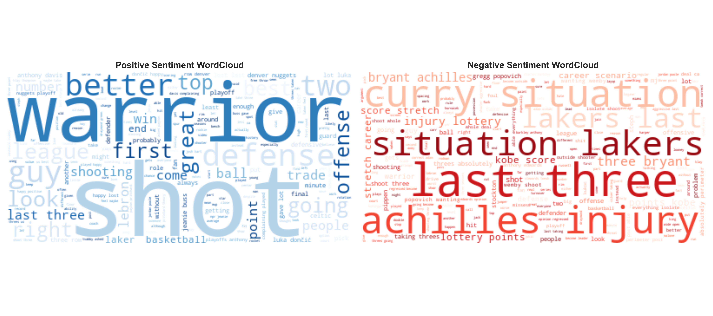

# The Three-Point Revolution: Is It Changing Basketball for Better or Worse?

## Overview
This project analyzes the NBA’s shift toward three-point shooting and its impact on competitiveness, game outcomes, and fan engagement. By examining historical game data, win/loss records, and social media sentiment, this study aims to determine whether the three-point era has improved or harmed the game.

My approach combined quantitative statistics with qualitative fan perspectives to build a multidimensional view of the modern NBA. I explored not just **how many** three-pointers teams take, but **how well** they shoot them, how strategies cluster, and what fans have to say.

## Data Sources
- **NBA Statistics**: Team-level data from Basketball Reference and NBA.com/stats, including three-pointers attempted, shooting efficiency, pace, and win percentage from 1980–2024.
- **Social Media Sentiment**: Reddit posts from r/nba that mention “three” or “three-pointer,” analyzed using natural language processing tools to extract sentiment and track trends over time.

---

## Key Visualizations

### Total Three-Pointers Attempted by Year

This chart highlights the explosive rise in three-pointers attempted, especially after 2015. We also see an earlier spike during the shortened three-point line experiment from 1994–1997.

### Three-Point Accuracy Over Time

Three-point accuracy has steadily improved over time. League averages stabilized around 2010, suggesting that players have adjusted to the shot and its role in team offense.

### All-Time Three-Point Leaders

Steph Curry stands far ahead of all-time leaders, symbolizing the modern three-point revolution. Most leaders are active or recent players, showing how the shot has transformed scoring profiles.

### Team Three-Pointers Attempted by Season

Nearly every team has ramped up three-pointers attempted over time. Some, like Houston and Golden State, pushed the boundaries of volume, redefining expectations for modern offense.

---

## Analytical Highlights

### Clustered Team Strategies

Using PCA (Principal Component Analysis) and KMeans clustering, teams naturally group into 3 strategy styles:
- **Efficient 3-point shooters with high win rates**
- **High-volume three-point teams with moderate success**
- **Low three-point teams with low win rates**

### Which Style Wins?

Teams that shoot efficiently — not just frequently — win more games. ANOVA confirmed these differences were statistically significant with p < 0.001 and η² = 0.14. Tukey HSD tests showed significant pairwise gaps in win percentage among the clusters, with efficient teams outperforming both volume-heavy and low-volume squads.

---

## Fan Sentiment Findings

### Sentiment Word Clouds

I used natural language processing on Reddit threads to gauge fan sentiment. Despite dramatic increases in three-point attempts, fan tone has remained mostly stable — and even leaned positive post-2015. Common positive terms included “great” and “defense,” while negative mentions often focused on injuries or specific teams.

---

## Summary of Findings
- **Shooting well > shooting more**: Accuracy was consistently a better predictor of win percentage than volume.
- **Franchise strategies differ**: Some teams (like Charlotte or San Antonio) maintain the same style year to year, while others (like the Warriors) have transformed.
- **Fan reactions are nuanced**: While some nostalgia exists for the old-school game, most fans enjoy the faster pace and skill-based play.
- **Statistical validation**: Regression models showed that three-point percentage became increasingly predictive of win percentage after 2015. ANOVA and clustering confirmed statistically distinct team styles and performance.

---

## What’s Next?
Future work could include:
- Clustering **players** based on three-point efficiency and role
- Comparing **playoff vs regular season** strategies
- Adding **video-based shot quality** metrics
- Analyzing blowout margins and game competitiveness
- Expanding fan sentiment to include interviews, attendance trends, and regional/national variations

---

## Author
Charity Smith
